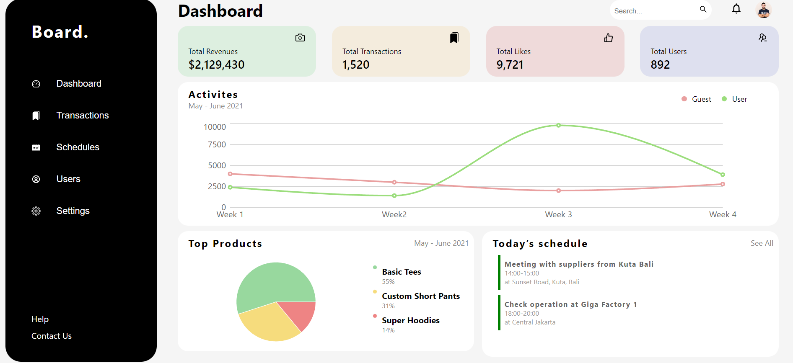

To run the app locally :
1. Clone the repository
2. Run npm install
3. Run npm start

To handle routing React-Routers has been used

Authentication has been handled using Google OAuth

Context of the app has been maintained using React Context

The graph [ LineCharts, PieCharts ] has been built using ReCharts library

For now, the app is not responsive.

Page 1.

Page 2.

